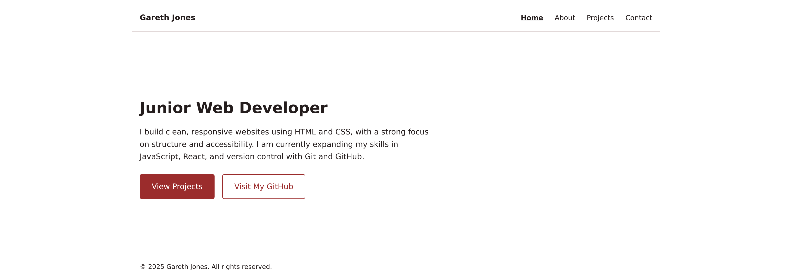

# Portfolio Website

Personal portfolio site for Gareth Jones, a junior front-end developer. Built
from scratch with semantic HTML5 and modular CSS — no frameworks, no build step.

**Live site:** https://gsjones1994-sudo.github.io/portfolio-website/



## Pages

| Page            | Description                                 |
| --------------- | ------------------------------------------- |
| `index.html`    | Hero introduction and calls to action       |
| `about.html`    | Background and skills                       |
| `projects.html` | Project cards with live demo / source links |
| `contact.html`  | Email, GitHub, LinkedIn and CV              |
| `404.html`      | Not-found page served by GitHub Pages       |

## Running locally

No dependencies or build step. Either open `index.html` in a browser, or serve
the folder so that root-relative paths behave like they do in production:

```bash
python3 -m http.server 8000
# then visit http://localhost:8000
```

## Structure

```
assets/
  docs/     CV (PDF)
  icons/    favicons, touch icon, manifest icons
  images/   photos and project screenshots
css/
  reset.css       box-sizing, list/img/address normalisation, reduced-motion
  variables.css   design tokens (colours, type scale, max width)
  base.css        element-level typography and focus styles
  layout.css      page structure, grid and responsive rules
  components.css  nav, buttons, cards, skip link
```

Stylesheets are loaded in that order; later files depend on tokens defined in
`variables.css`.

## Accessibility

- Semantic landmarks (`header`, `nav`, `main`, `footer`) on every page
- Skip-to-content link
- `aria-current="page"` on the active nav item
- Visible `:focus-visible` outlines throughout
- Motion-reducing hover effects under `prefers-reduced-motion`

## Deployment

Deployed via GitHub Pages from the default branch. Pushing to it publishes the
site.
